# Hash tables
Implemetations of hash functions and hash tables

# Continuous Integration Status


## Installation
To use this package, you need to have [Python3](https://www.python.org/download/releases/3.0/) in your environment. And the used packages are listed below.

### Used Packages
* os
* sys
* time
* argparse
* unittest
* matplotlib
* pycodestyle

## Usage

### Plot Scatters of Hash Functions
#### Arguments of hash_functions.py
* input: the input file name, e.g. non_rand_words.txt
* hash_method: hash algorithm, e.g. ascii/rolling

#### h_ascii with random words
```bash
python hash_functions.py --input rand_words.txt --hash_method ascii | python scatter.py --out_file images/ascii_hash_function_rand.png --x_label "Hashed Word" --y_label "Hashed Value"
```
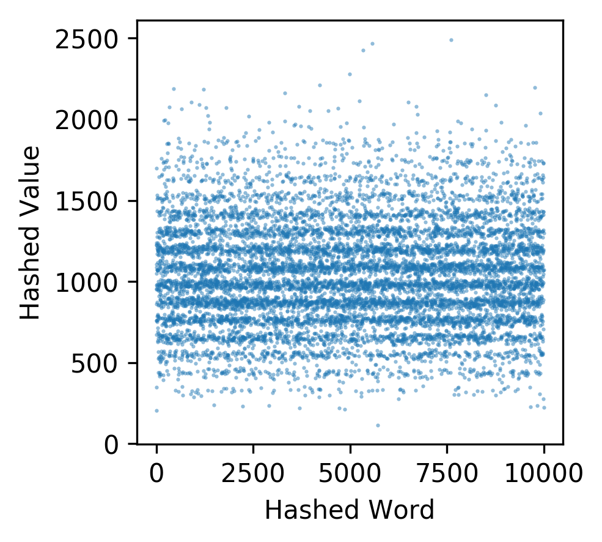

#### h_ascii with non random words
```bash
python hash_functions.py --input non_rand_words.txt --hash_method ascii | python scatter.py --out_file images/ascii_hash_function_non_rand.png --x_label "Hashed Word" --y_label "Hashed Value"
```
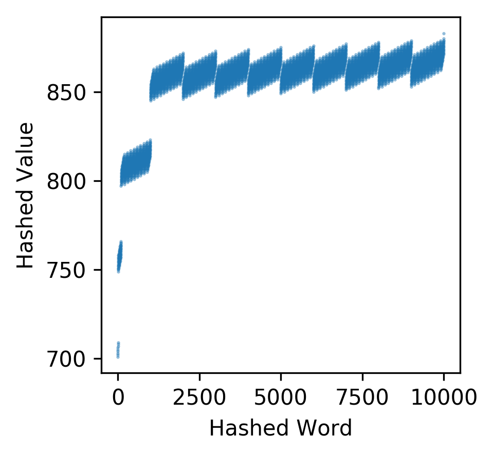

#### h_rolling with random words
```bash
python hash_functions.py --input rand_words.txt --hash_method rolling | python scatter.py --out_file images/rolling_hash_function_rand.png --x_label "Hashed Word" --y_label "Hashed Value"
```
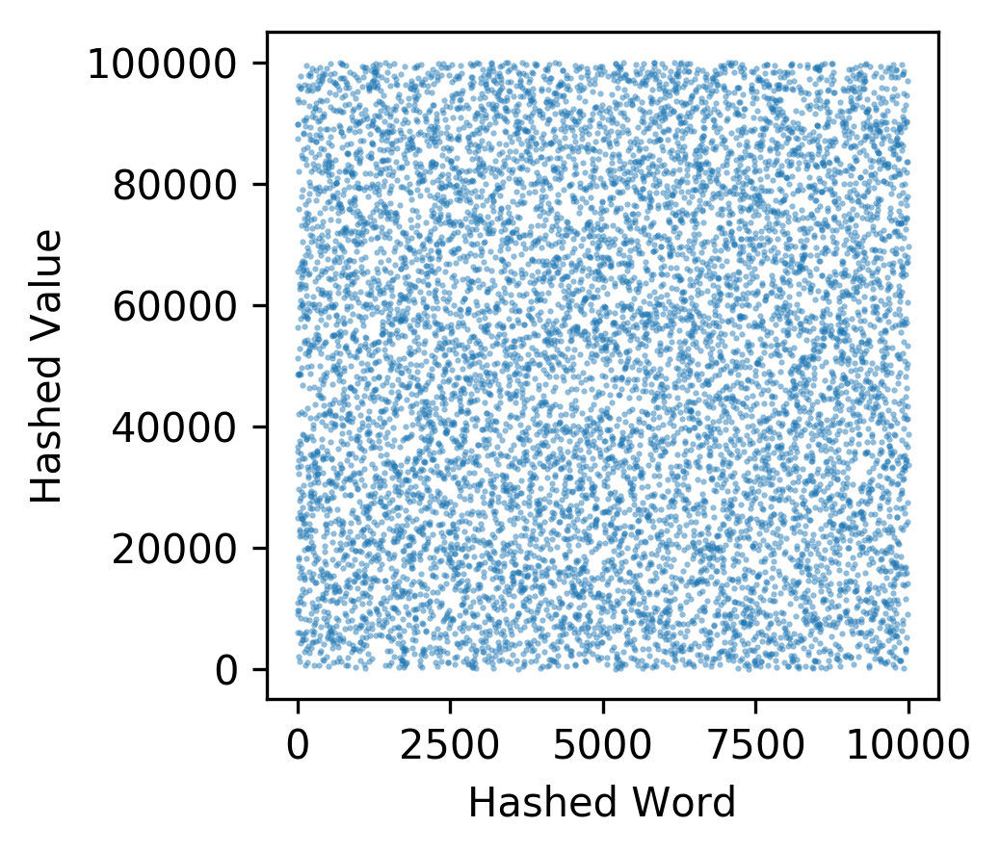

#### h_rolling with non random words
```bash
python hash_functions.py --input non_rand_words.txt --hash_method rolling | python scatter.py --out_file images/rolling_hash_function_non_rand.png --x_label "Hashed Word" --y_label "Hashed Value"
```
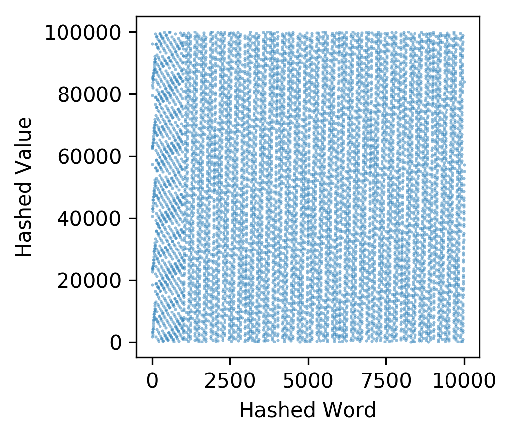

#### Arguments of hash_tables.py
* size: size of the hash table
* hash_method: hash algorithm, e.g. ascii/rolling
* collision_strategy: strategy to deal with collisions, e.g. linear/chained
* input: the input file name, e.g. non_rand_words.txt
* key_num: number of keys to be added
* search_nums: number of searching times

#### Rolling with Linear Probing
```bash
for M in $(seq 1000 1000 10000); do
    python hash_tables.py --size 10000 --hash_method rolling --collision_strategy linear --input rand_words.txt --key_nums $M --search_nums 100 > test_rolling_linear_rand.$M.txt
done

grep add test_rolling_linear_rand.*.txt | cut -d " " -f2,3 | python scatter.py --out_file images/rolling_linear_add_time.png --x_label "Load Factor" --y_label "Insert Time"
grep search test_rolling_linear_rand.*.txt | cut -d " " -f2,3 | python scatter.py --out_file images/rolling_linear_search_time.png --x_label "Load Factor" --y_label "Search Time"
```
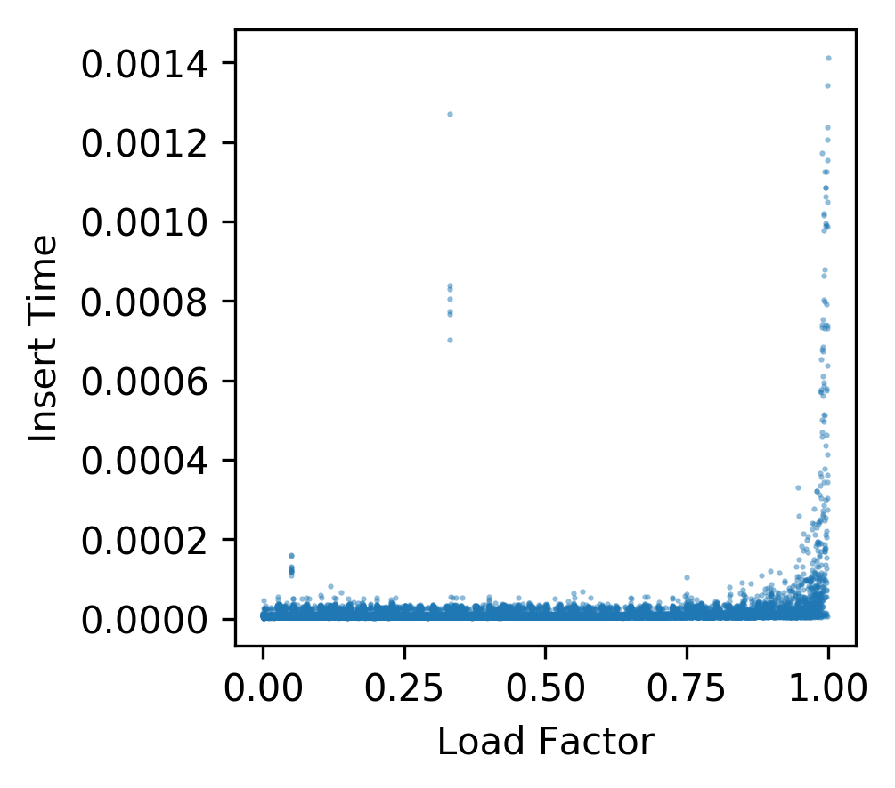
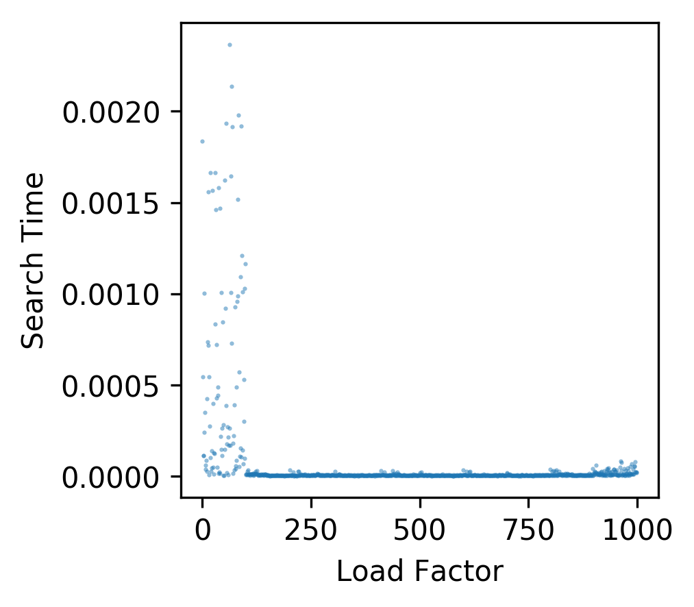

#### Ascii with Linear Probing
```bash
for M in $(seq 1000 1000 10000); do
    python hash_tables.py --size 10000 --hash_method ascii --collision_strategy linear --input rand_words.txt --key_nums $M --search_nums 100 > test_ascii_linear_rand.$M.txt
done

grep add test_ascii_linear_rand.*.txt | cut -d " " -f2,3 | python scatter.py --out_file images/ascii_linear_add_time.png --x_label "Load Factor" --y_label "Insert Time"
grep search test_ascii_linear_rand.*.txt | cut -d " " -f2,3 | python scatter.py --out_file images/ascii_linear_search_time.png --x_label "Load Factor" --y_label "Search Time"
```
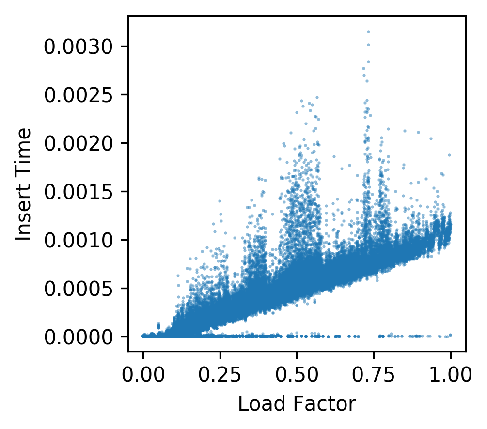
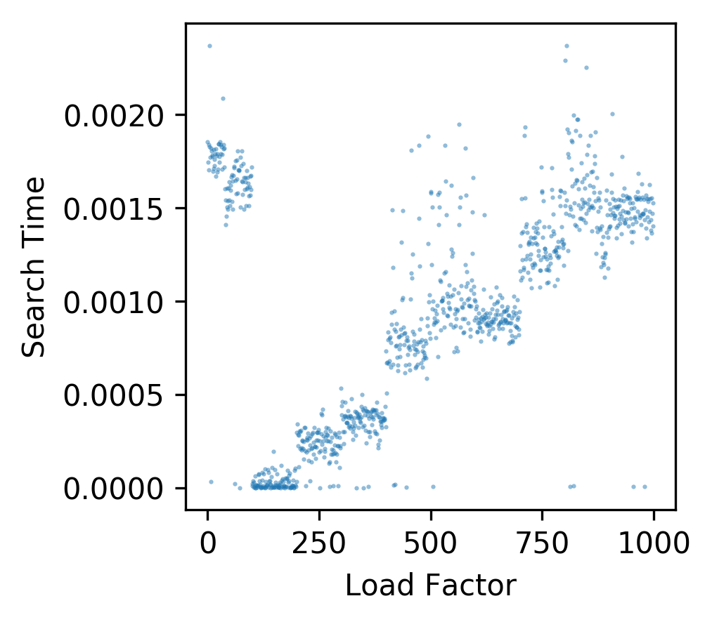

#### Rolling with Chained Hash
```bash
for M in $(seq 1000 1000 10000); do
    python hash_tables.py --size 10000 --hash_method rolling --collision_strategy chain --input rand_words.txt --key_nums $M --search_nums 100 > test_rolling_chain_rand.$M.txt
done

grep add test_rolling_chain_rand.*.txt | cut -d " " -f2,3 | python scatter.py --out_file images/rolling_chain_add_time.png --x_label "Load Factor" --y_label "Insert Time"
grep search test_rolling_chain_rand.*.txt | cut -d " " -f2,3 | python scatter.py --out_file images/rolling_chain_search_time.png --x_label "Load Factor" --y_label "Search Time"
```
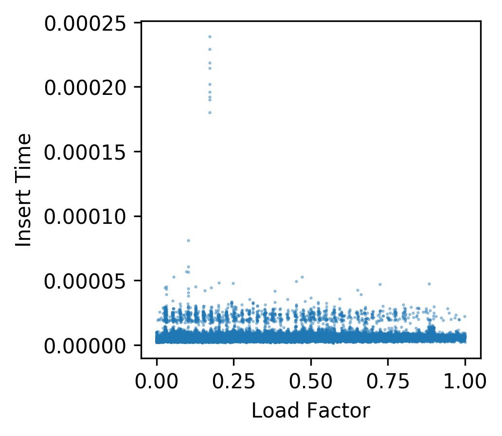
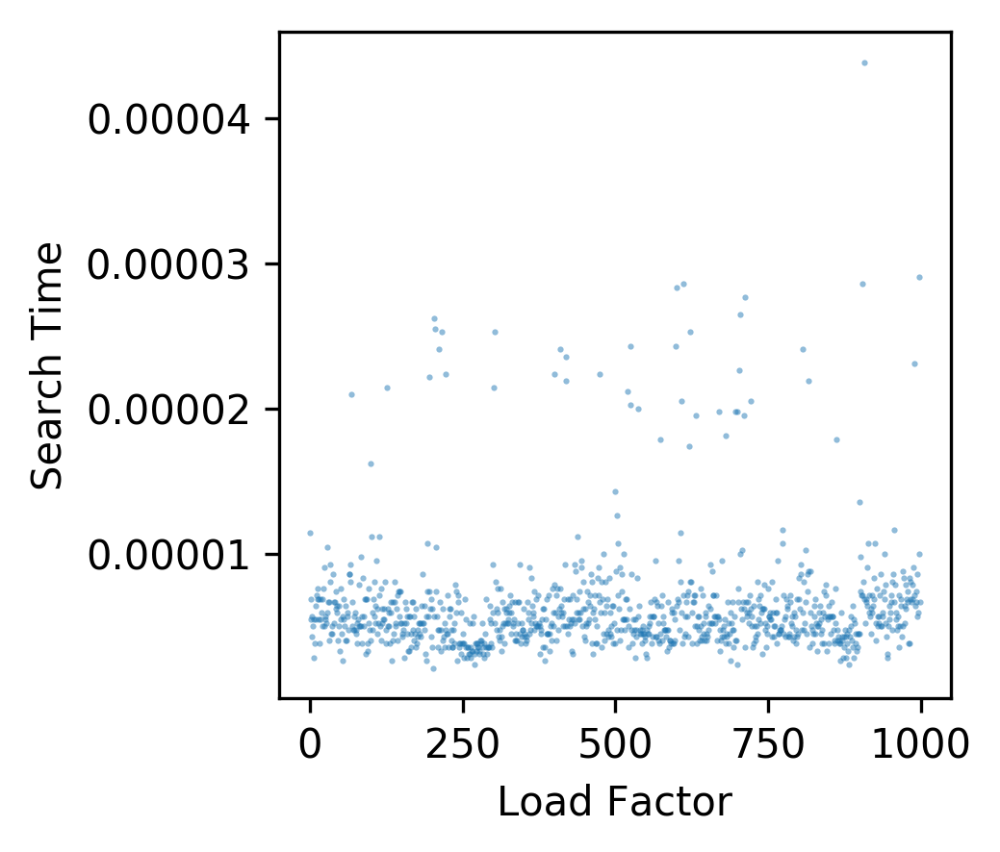

#### Ascii with Chained Hash
```bash
for M in $(seq 1000 1000 10000); do
    python hash_tables.py --size 10000 --hash_method ascii --collision_strategy chain --input rand_words.txt --key_nums $M --search_nums 100 > test_ascii_chain_rand.$M.txt
done

grep add test_ascii_chain_rand.*.txt | cut -d " " -f2,3 | python scatter.py --out_file images/ascii_chain_add_time.png --x_label "Load Factor" --y_label "Insert Time"
grep search test_ascii_chain_rand.*.txt | cut -d " " -f2,3 | python scatter.py --out_file images/ascii_chain_search_time.png --x_label "Load Factor" --y_label "Search Time"
```
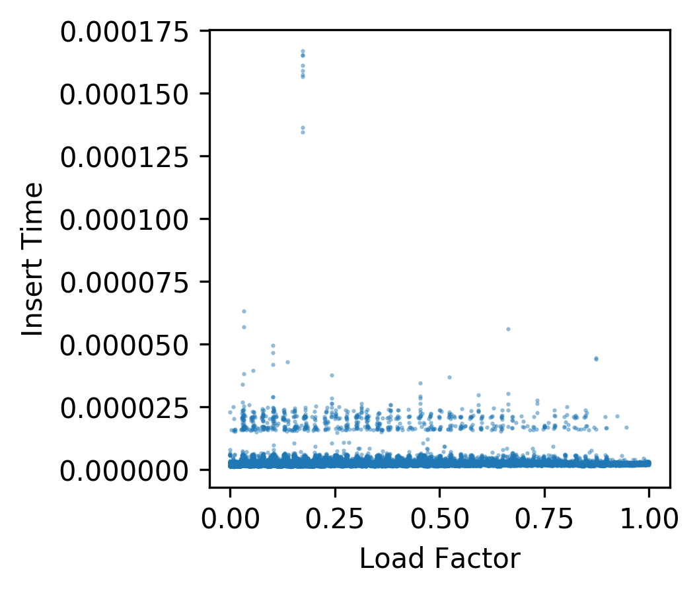
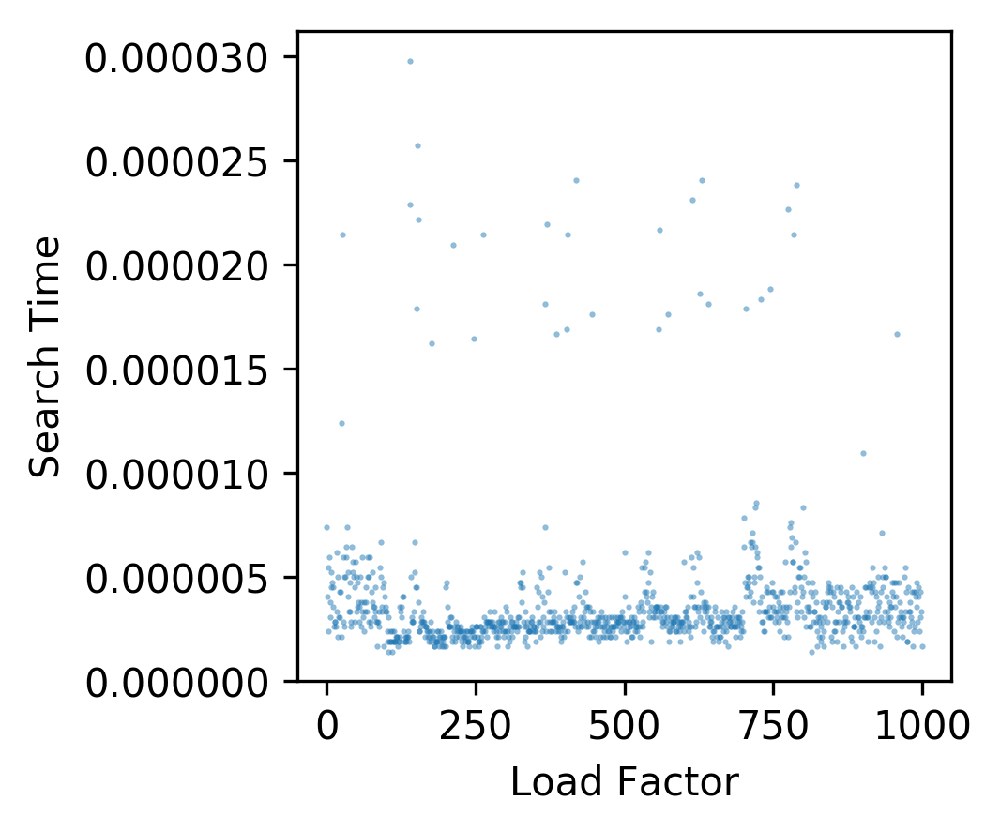
